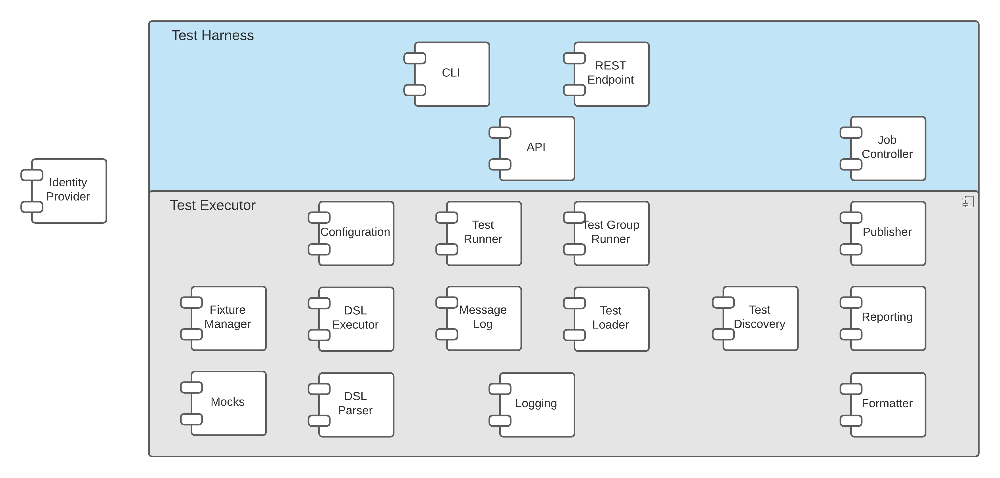

# conformance-test-harness
Harness used to run Solid conformance tests and generate reports.

<!-- MarkdownTOC -->

- [Repo structure](#repo-structure)
- [Architecture](#architecture)
	- [Test harness](#test-harness)
	- [Test executor](#test-executor)
	- [Test suite description document](#test-suite-description-document)
	- [Test cases](#test-cases)
	- [Conformance report](#conformance-report)
- [Component Architecture](#component-architecture)
- [Test suite description document](#test-suite-description-document-1)
- [Usage](#usage)
	- [Configuration](#configuration)
	- [Execution](#execution)
- [Writing tests](#writing-tests)

<!-- /MarkdownTOC -->

## Repo structure

  * architecture : Architectural diagrams
  * PoC : Proof of concept carried out when deciding on technical stack for the harness

## Architecture

### Test harness

The test harness controls the overall execution of a test suite. It is responsible for loading the test suite, locating the tests, creating and controlling test executors and generating test suite compliance reports.

The harness will provide different interfaces to the test suite such as a REST API and a command line interface, and will be platform agnostic. 

### Test executor
The test executor is responsible for executing tests against a Solid server. The harness can create multiple test executors where each is responsible for executing a set of tests. Test executors do not need to run on the same host as the test harness. 

### Test suite description document
This is an RDF document containing metadata about the test suite. The metadata includes;

  * Prerequisites (e.g. dependencies)
  * equirements level from the specification (e.g., MUST, SHOULD, MAY, etc.)
  * References to the appropriate section in the specification
  * References to the actual tests

The test suite at any point in time may not cover all of the tests required for the specifications. The test harness will use the linkage between the test suite document and the RDF in the specifications to determine how much of the specifications are covered by the test suite.

### Test cases

The test cases will be contained in a repository and may be grouped in various ways to enable logical sets of tests to be grouped cohesively. 

### Conformance report

Conformance reports will be generated using EARL thereby making them available for consumption by many different tools. 

## Component Architecture

The following is an illustration of the component architecture for the test harness and executor.

## Test suite description document

## Usage

### Configuration

### Execution

## Writing tests